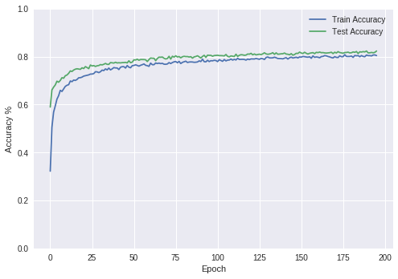

## Forest Covertype Dataset
Download: https://datahub.io/machine-learning/covertype#data

## Deep Learning
* Read the dataset
* Separate features and labels
* Train/Test split
* Define a Neural Network in Keras
* Experimentation

## Accuracy Plot

